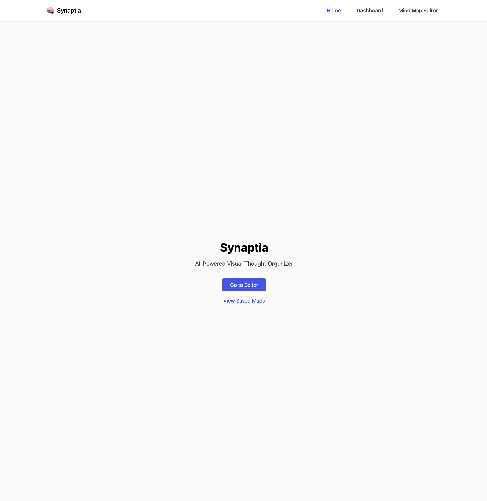
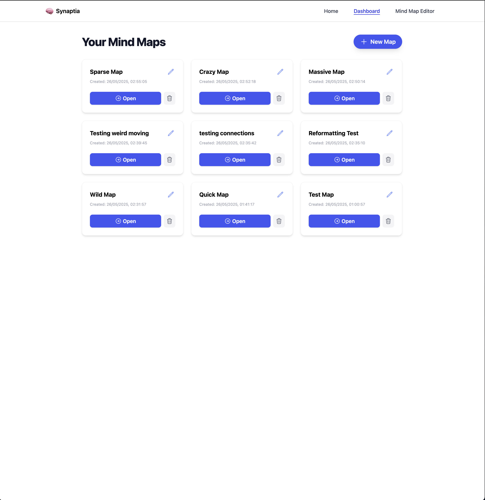
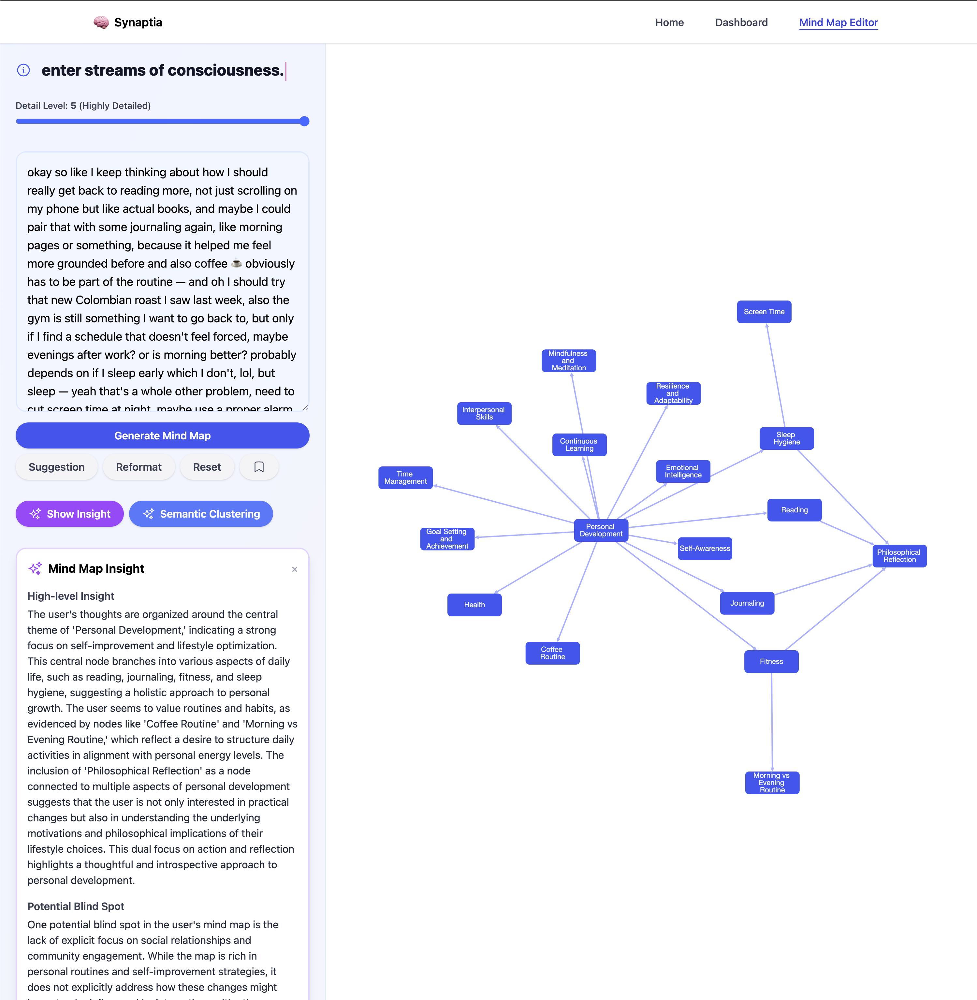
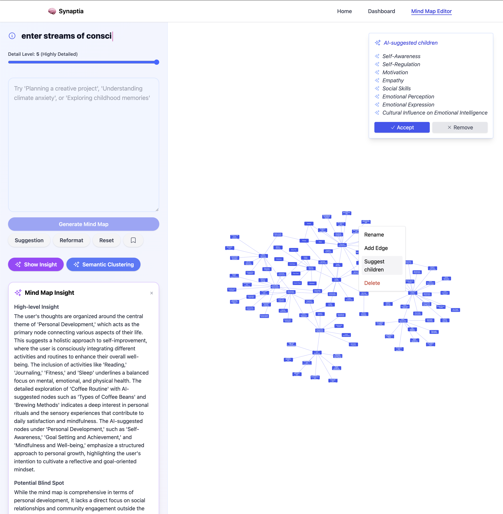
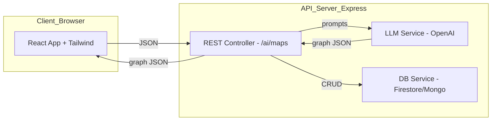

# Synaptia – AI‑Powered Visual Thought Organizer

## Overview

Synaptia is a full‑stack web application that converts unstructured notes or stream‑of‑consciousness text into an interactive visual mind map. It features a modern React 18 frontend (with Vite, Zustand for state, Cytoscape.js for graph visualization, and Tailwind CSS for styling) and a robust Node.js 20 + Express backend written in TypeScript. The backend integrates with OpenAI GPT-4o for advanced AI-powered text segmentation, clustering, summarization, and idea expansion.

---

## Demo

<p align="center">
  
  <br><b>Home Page</b> – Entry point for users to start mapping their thoughts.
</p>

<p align="center">
  
  <br><b>Dashboard</b> – View, rename, delete, and open saved mind maps.
</p>

<p align="center">
  
  <br><b>Mind Map Editor</b> – The main interface for generating, editing, and exploring mind maps.
</p>

<p align="center">
  
  <br><b>Mind Map Functionality</b> – Demonstrates node actions, AI features, and detail-level slider.
</p>

---

## Feature Checklist

| #  | Feature                       | Mandatory | Description                                                |
| -- | ----------------------------- | --------- | ---------------------------------------------------------- |
| 1  | Free‑form text input          | ✓         | Users paste or type raw notes.                             |
| 2  | GPT‑based processing pipeline | ✓         | Chunking, clustering, title generation, summary sentences. |
| 3  | Interactive mind‑map UI       | ✓         | Zoom, pan, drag, collapse/expand nodes, context menu.      |
| 4  | Node actions                  | ✓         | Expand (generate children), rename, delete.                |
| 5  | Local save/load               | ✓         | Persist maps to `localStorage`.                            |
| 6  | Multi‑map dashboard           | ✓         | List, rename, delete saved maps.                           |
| 7  | Export as PNG / SVG           | Optional  | Uses `html2canvas` and Cytoscape SVG export.               |
| 8  | Firebase authentication       | Optional  | Email/password + OAuth providers.                          |
| 9  | Cloud persistence             | Optional  | Firestore or MongoDB Atlas.                                |
| 10 | Dark/Light theme toggle       | Optional  | Tailwind + CSS variables.                                  |

---

## Technology Stack

### Front‑end

| Purpose       | Choice                                                  | Rationale                                            |
| ------------- | ------------------------------------------------------- | ---------------------------------------------------- |
| Framework     | **React 18** (Vite)                                     | Hooks, fast refresh, ecosystem.                      |
| Visualisation | **Cytoscape.js** with `react‑cytoscapejs` wrapper       | Mature graph library, built‑in layouts.              |
| Styling       | **Tailwind CSS 3**                                      | Utility‑first, theming ease.                         |
| State         | **Zustand**                                             | Lightweight global store for nodes, edges, UI state. |
| Routing       | **React Router 6**                                      | Dashboard vs editor routes.                          |
| Forms         | **React Hook Form**                                     | Minimal re‑renders, validation.                      |
| Type checking | **TypeScript 5**                                        | Safety, IDE help.                                    |
| Testing       | **Vitest** + **React Testing Library**, **Cypress** e2e | Fast unit tests & browser automation.                |

### Back‑end

| Layer              | Choice                       | Notes                               |
| ------------------ | ---------------------------- | ----------------------------------- |
| Runtime            | **Node.js 20**               | Modern LTS.                         |
| Web server         | **Express 4**                | Minimal, familiar.                  |
| AI service         | **OpenAI GPT‑4o** (via REST) | Replaceable via `services/llm.ts`.  |
| Storage (optional) | **Firestore** or **MongoDB** | Abstracted behind `services/db.ts`. |
| Auth (optional)    | **Firebase Auth**            | JWT flow handled client‑side.       |
| Tests              | **Jest** + **Supertest**     | API contract assurance.             |

### DevOps & Tooling

* **Docker** – reproducible environments.
* **ESLint** + **Prettier** – code quality.
* **Husky** + **lint‑staged** – pre‑commit hooks.
* **GitHub Actions** – CI pipeline: lint, test, build, Cypress.
* **Vercel** – front‑end deploy; **Railway** – back‑end deploy.

---

## High‑Level Architecture



---

## Prompt Engineering Specification

The LLM must always produce a JSON shape matching the TypeScript interface below, otherwise the front‑end will reject the response.

```ts
interface MindMapResponse {
  nodes: { id: string; label: string; summary?: string }[];
  edges: { source: string; target: string }[];
}
```

**System prompt** (stored in `/backend/prompts/base.txt`):

```
You are an assistant that transforms user notes into a coherent mind map. ...
```

**User prompt template** (pseudo‑code in `backend/utils/prompt.ts`):

```ts
return `${base}\n\nUSER_NOTES:\n${userText}\n\nRESPONSE_FORMAT:\n${formatBlock}`;
```

---

## Folder Structure

```
map‑my‑mind/
├── apps/
│   ├── client/             # React front‑end (Vite)
│   │   ├── public/
│   │   ├── src/
│   │   │   ├── components/
│   │   │   │   ├── editor/
│   │   │   │   │   ├── MindMap.tsx
│   │   │   │   │   ├── NodeMenu.tsx
│   │   │   │   │   └── Toolbar.tsx
│   │   │   │   ├── dashboard/
│   │   │   │   │   └── MapCard.tsx
│   │   │   │   └── ui/     # Generic UI atoms
│   │   │   ├── hooks/
│   │   │   │   └── useMindMapStore.ts
│   │   │   ├── pages/
│   │   │   │   ├── index.tsx
│   │   │   │   └── maps/[id].tsx
│   │   │   ├── routes.tsx
│   │   │   ├── styles/
│   │   │   │   └── tailwind.css
│   │   │   └── vite-env.d.ts
│   │   ├── tsconfig.json
│   │   └── vite.config.ts
│   └── server/             # Node/Express API
│       ├── src/
│       │   ├── controllers/
│       │   │   └── ai.controller.ts
│       │   ├── services/
│       │   │   ├── llm.service.ts
│       │   │   └── db.service.ts
│       │   ├── utils/
│       │   │   ├── chunkText.ts
│       │   │   └── prompt.ts
│       │   ├── routes.ts
│       │   └── index.ts
│       ├── tests/
│       └── tsconfig.json
├── docker-compose.yml
├── .env.template
├── .github/
│   └── workflows/
│       └── ci.yml
├── package.json            # Workspace root (pnpm or yarn workspaces)
├── tsconfig.base.json
└── README.md
```

---

## Prerequisites

* Node.js 20+
* pnpm 9 (preferred) or Yarn 3 (workspaces enabled)
* Docker Desktop (optional for DB)
* OpenAI API key
* GitHub account (for CI)

---

## Local Development Setup

### 1. Clone and bootstrap

```bash
git clone https://github.com/your‑handle/map‑my‑mind.git
cd map‑my‑mind
pnpm install         # installs root, client, and server deps
cp .env.template .env # set OPENAI_API_KEY, FIREBASE_*
```

### 2. Run services in parallel

```bash
pnpm dev             # uses concurrently to run client and server
```

* Client: [http://localhost:5173](http://localhost:5173)
* Server: [http://localhost:4000](http://localhost:4000)

### 3. Storybook (UI docs)

```bash
pnpm --filter client storybook
```

### 4. Lint, type‑check, test

```bash
pnpm lint
pnpm typecheck
pnpm test            # Vitest + Jest + Cypress component tests
```

---

## Build & Production Deployment

### Build artefacts

```bash
pnpm build           # builds client (dist/) and server (tsc)
```

The CI pipeline produces two artefacts:

* `client/dist` – static files for Vercel.
* `server/dist` – compiled JS + `package.json` for Railway container.

### Docker

```bash
docker compose up --build
```

This spins up:

* `client` – nginx serving `dist`
* `server` – Node 20 alpine
* `firebase‑emulator` (optional)

### Vercel + Railway (recommended)

1. Import repo into Vercel; set root to `apps/client`.
2. Import repo into Railway; deploy from `apps/server`.
3. Add environment variables in both dashboards.
4. Set Vercel environment `VITE_API_URL` to Railway public URL.

---

## NPM Scripts Reference (root `package.json`)

| Script      | Description                                               |
| ----------- | --------------------------------------------------------- |
| `dev`       | Concurrently runs client (`vite`) and server (`nodemon`). |
| `build`     | Builds both workspaces.                                   |
| `lint`      | ESLint + Prettier check.                                  |
| `typecheck` | `tsc --noEmit` across workspaces.                         |
| `test`      | Unit + integration test suites.                           |
| `cypress`   | Opens Cypress UI.                                         |
| `storybook` | Runs Storybook for component docs.                        |

---

## API Reference

### POST /api/maps

| Field      | Type   | Required | Description                                    |
| ---------- | ------ | -------- | ---------------------------------------------- |
| `text`     | string | yes      | Raw user notes.                                |
| `parentId` | string | no       | If present, the map expansion context node id. |

**Response** – `200 OK`

```json
{
  "nodes": [ { "id": "n1", "label": "Topic" } ],
  "edges": [ { "source": "root", "target": "n1" } ]
}
```

Error codes: `400` invalid input, `500` LLM failure.

---

## Testing Strategy

* **Unit tests** – pure functions (`chunkText`, `prompt.ts`).
* **Component tests** – MindMap interactions using Cypress component runner.
* **E2E tests** – generate map from sample text and assert graph.
* **Contract tests** – server responses match schema using `zod`.
* **CI** – All tests + lint + typecheck must pass before merge.

---

## Continuous Integration (GitHub Actions `.github/workflows/ci.yml`)

```yaml
name: CI
on: [push, pull_request]
jobs:
  build:
    runs-on: ubuntu-latest
    steps:
      - uses: actions/checkout@v4
      - uses: pnpm/action-setup@v2
        with:
          version: 9
      - name: Install deps
        run: pnpm install --frozen-lockfile
      - name: Lint
        run: pnpm lint
      - name: Typecheck
        run: pnpm typecheck
      - name: Test
        run: pnpm test
```

---

## Roadmap

1. MVP (outlined features 1‑6)
2. Authentication + cloud sync
3. Collaboration mode (WebSockets, Yjs CRDT)
4. GPT‑based autocompletion of partial ideas
5. SVG export and presentation mode
6. Mobile PWA offline cache

---

## Contribution Guide

1. Fork → feature branch naming `feat/<topic>`.
2. Follow commit convention `type(scope): message` (Conventional Commits).
3. Pull request template auto‑included.
4. All PRs require green CI and at least one review.

---

## License

MIT

---

## Acknowledgements

* OpenAI for GPT‑4o API.
* Cytoscape.js authors.
* Tailwind CSS contributors.

---

*End of README*
